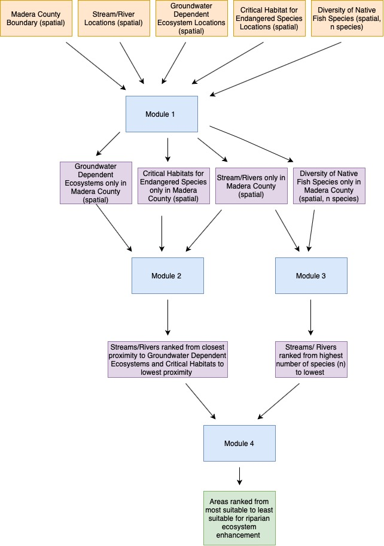

```{r setup, include=FALSE}
knitr::opts_chunk$set(echo = TRUE)

```

### Goal

The goal of this model is find which riparian areas in Madera County, California might be best targeted for ecosystem enhancement and restoration projects. 

The inspiration for this assignment comes from a section of Annika's group project, Flood Forward. 


## Overall Contract

### Inputs:

- Madera County boundaries 
- National Hydrography Dataset stream/river data
- Groundwater Dependent Ecosystem data 
- Critical habitat for endangered species data 
- Diversity of native fish species data 

### Parameters: 
- Madera county boundary (spatial - latitude and longitude coordinates)

- Stream/river locations (spatial - latitude and longitude coordinates)

- Groundwater Dependent Ecosystem locations (spatial - latitude and longitude coordinates)

- Critical habitat locations (spatial - latitude and longitude coordinates)

- Number of diverse native fish species (spatial - latitude and longitude coordinates, and count of diverse species (n), species name)

### Output:

The output is locations along stream/river channels most suitable for ecosystem enhancement/restoration projects (spatial, location). 

### Modules: 

1. Clip all spatial input layers to the Madera County boundary.

Contract: The user gives Madera County boundary spatial data, groundwater dependent ecosystem spatial data, critical habitat spatial data, native fish species spatial data. The function will clip each spatial dataset to the Madera County boundary to include only locations located within Madera County. 


2. Determine proximity of Groundwater Dependent Ecosystem locations and Critical Habitat for Endangered Species locations to a stream/river.

Contract: The user gives locations of groundwater dependent ecosystems and critical habitat locations and locations of streams/rivers. The function will rank streams/rivers by their proximity to groundwater dependent ecosystems and critical habitat locations. 


3. Count how many native fish species are present at any given location in a stream/river.

Contract: The user gives counts for number of native fish species (n) at various locations. The function will rank locations from higher (n) to lower (n).  


4. Determine which locations have high counts for fish species and also have groundwater dependent ecosystems and critical habitats in close proximity to a stream/river

Contract: The user gives the outputs from modules 2 amd 3 as the input. The function ranks locations so that high counts (n) of fish species and high scores for proximity of groundwater dependent ecosystems and critical habitats are scored highest. 

### Diagram 



